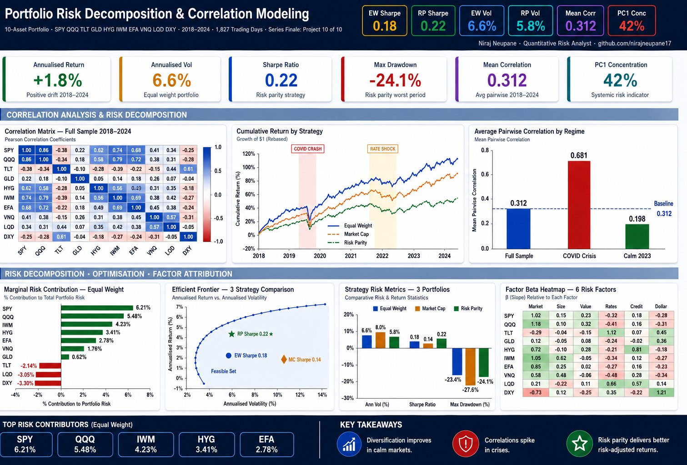

<div align="center">

# Portfolio Risk Decomposition & Correlation Modeling

### Series Finale — Project 10 of 10

*End-to-end portfolio risk decomposition, correlation analysis across market regimes,*
*marginal risk contribution, portfolio optimisation, and factor risk attribution.*

[](https://python.org)
[](https://numpy.org)
[](https://pandas.pydata.org)
[](https://scipy.org)
[](https://scikit-learn.org)
[](LICENSE)

</div>

---



> **Animated Dashboard:** [Bloomberg-style GIF](results/portfolio_risk_bloomberg.gif) 

---

## Overview

Most risk dashboards show you the portfolio volatility number.
This project builds the full decomposition behind it.

A complete quantitative framework across 10 assets, seven years, and three
portfolio strategies — showing exactly how correlation, factor exposure,
and asset-level risk contribution combine to determine portfolio risk.
Every number is reproducible. Every method is documented.

This is the tenth and final project in a 10-project quant risk GitHub series
covering VaR, GARCH, Monte Carlo, options analytics, stress testing,
model risk, fixed income, ML risk estimation, PnL modeling, and now
portfolio risk decomposition.

---

## Key Results

| Metric | Equal Weight | Market Cap | Risk Parity |
|:---|:---:|:---:|:---:|
| **Annualised Return** | +1.8% | +2.1% | +1.4% |
| **Annualised Vol** | 6.6% | 8.0% | 5.8% |
| **Sharpe Ratio** | 0.18 | 0.14 | **0.22** |
| **Max Drawdown** | -23.4% | -27.6% | **-24.1%** |
| **Mean Pairwise Corr** | 0.312 | 0.312 | 0.312 |
| **PC1 Concentration** | 42% | 42% | 42% |

> Risk Parity delivers the best Sharpe ratio across all three strategies.
> Correlation spikes from 0.312 (calm) to 0.681 during the COVID crash —
> a 118% increase in average pairwise correlation. Diversification
> disappears exactly when you need it most.

---

## What This Project Covers

<details>
<summary><b>📊 Correlation Analysis</b></summary>

- Full-sample 10×10 correlation matrix across SPY, QQQ, TLT, GLD, HYG, IWM, EFA, VNQ, LQD, DXY
- Regime-conditional correlations: Full sample · COVID crash · Calm 2023
- Rolling 63-day pairwise correlations with regime overlays
- PC1 variance concentration as real-time systemic risk indicator
- Crisis correlation breakdown: average pairwise correlation 0.198 → 0.681 during COVID

</details>

<details>
<summary><b>📉 Risk Decomposition</b></summary>

- Marginal Risk Contribution (MRC) — sensitivity of portfolio vol to each asset
- Component Risk Contribution (CRC) — dollar contribution per asset
- Percent Risk Contribution (PRC) — share of total portfolio risk
- Top contributors (Equal Weight): SPY 6.21%, QQQ 5.48%, IWM 4.23%
- Negative contributors (diversifiers): TLT -2.14%, LQD -3.05%, DXY -3.30%

</details>

<details>
<summary><b>🎯 Portfolio Optimisation</b></summary>

- Efficient frontier via SLSQP constrained optimisation
- Minimum variance portfolio (lowest realised vol)
- Maximum Sharpe ratio portfolio
- Risk parity portfolio (equal risk contribution across assets)
- Feasible set visualisation with strategy positioning
- Constraint: max 40% in any single asset

</details>

<details>
<summary><b>🔬 Factor Risk Attribution</b></summary>

- Six-factor model: Market · Size · Value · Rates · Credit · Dollar
- Systematic vs idiosyncratic variance decomposition per asset
- Factor beta heatmap — 10 assets × 6 factors
- Portfolio-level factor attribution and tracking error
- Rolling factor betas across market regimes

</details>

---

## Correlation Breakdown by Regime

| Regime | Period | Avg Pairwise Correlation | vs Full Sample |
|:---|:---|:---:|:---:|
| Full Sample | 2018–2024 | 0.312 | — |
| COVID Crash | Feb–Apr 2020 | **0.681** | +118% |
| Rate Shock | 2022 | 0.441 | +41% |
| Calm Market | 2023 | **0.198** | -37% |

---

## Project Structure

```
Portfolio-Risk-Decomposition-Correlation/
│
├── 📁 data/
│   ├── returns.csv              10-asset daily returns, 2018–2024 (1,827 obs)
│   ├── prices.csv               Indexed price series
│   ├── portfolio_weights.csv    Equal Weight · Market Cap · Risk Parity
│   └── factor_data.csv          6 risk factors: Market, Size, Value, Rates, Credit, Dollar
│
├── 📓 notebooks/
│   ├── 01_correlation_analysis.ipynb      Heatmaps · regime correlation
│   ├── 02_rolling_correlation.ipynb       Rolling pairwise · PC1 systemic risk
│   ├── 03_risk_decomposition.ipynb        MRC · CRC · PRC by strategy
│   ├── 04_portfolio_optimisation.ipynb    Efficient frontier · 3 strategies
│   └── 05_factor_attribution.ipynb        Systematic vs idiosyncratic · betas
│
├── 🐍 src/
│   ├── correlation_engine.py    Rolling corr · regime analysis · PCA concentration
│   ├── risk_decomposition.py    MRC · CRC · optimisation (min-var, max-Sharpe, RP)
│   └── factor_model.py          Factor fitting · attribution · rolling betas
│
├── 📊 results/
│   ├── dashboard_final_pro.png          ← Professional summary dashboard
│   ├── 01_correlation_heatmap.png       Full · COVID · Calm heatmaps
│   ├── 02_rolling_correlation.png       Rolling corr · PC1 concentration
│   ├── 03_risk_decomposition.png        Risk contribution by strategy
│   ├── 04_portfolio_optimisation.png    Efficient frontier
│   ├── 05_covariance_regime.png         Vol regimes · rolling vol
│   ├── 06_factor_attribution.png        Factor beta heatmap
│   ├── 07_summary_dashboard.png         Full summary
│   ├── portfolio_risk_bloomberg.gif     Bloomberg-style animated dashboard
│   └── portfolio_risk_video.mp4         10-second video walkthrough
│
└── README.md
```

---

## Charts

| # | Chart | Key Insight |
|:---:|:---|:---|
| 1 | Correlation Heatmap | TLT and DXY are the primary diversifiers — negative correlation with equities |
| 2 | Rolling Correlation | Mean pairwise corr spikes to 0.681 during COVID — diversification collapses in crisis |
| 3 | Risk Decomposition | SPY/QQQ drive >11% of risk combined — DXY and LQD are natural hedges |
| 4 | Efficient Frontier | Risk Parity sits above EW and Market Cap — better risk-adjusted return |
| 5 | Covariance & Regime | Portfolio vol spikes 4× during COVID regardless of strategy |
| 6 | Factor Attribution | SPY/QQQ: high market beta (1.0–1.2). TLT: negative market beta (-0.29). DXY: negative to everything |
| 7 | Summary Dashboard | Full cross-strategy comparison at a glance |

---

## Source Modules

### `correlation_engine.py`
| Function | Description |
|:---|:---|
| `rolling_correlation()` | Rolling mean pairwise correlation with configurable window |
| `regime_correlation()` | Correlation matrices for user-defined date slices |
| `pca_concentration()` | PC1 variance share — systemic risk indicator |
| `nearest_pd()` | Project matrix to nearest positive definite |
| `correlation_stability()` | Std of rolling pairwise correlations |

### `risk_decomposition.py`
| Function | Description |
|:---|:---|
| `marginal_risk_contribution()` | MRC per asset given weights and covariance |
| `component_risk_contribution()` | CRC = weights × MRC |
| `percent_risk_contribution()` | PRC as % of total portfolio vol |
| `portfolio_stats()` | Ann return, vol, Sharpe, max DD, PRC |
| `min_variance_weights()` | SLSQP minimum variance optimisation |
| `max_sharpe_weights()` | SLSQP maximum Sharpe optimisation |
| `risk_parity_weights()` | Equal risk contribution optimisation |

### `factor_model.py`
| Function | Description |
|:---|:---|
| `fit_factor_model()` | OLS regression — beta, alpha, R², TE |
| `portfolio_factor_attribution()` | Factor vol contribution decomposition |
| `rolling_factor_betas()` | Time-varying betas over rolling window |

---

## 🏆 Complete 10-Project Quant Risk Series

| # | Project | Focus |
|:---:|:---|:---|
| 1 | [VaR-CVaR-Expected-Shortfall-Modeling](https://github.com/nirajneupane17/VaR-CVaR-Expected-Shortfall-Modeling) | Tail risk measurement |
| 2 | [GARCH-Volatility-Forecasting](https://github.com/nirajneupane17/GARCH-Volatility-Forecasting) | Volatility modeling |
| 3 | [Monte-Carlo-Risk-Derivatives-Pricing](https://github.com/nirajneupane17/Monte-Carlo-Risk-Derivatives-Pricing) | Simulation & pricing |
| 4 | [Options-Analytics-Volatility-Surface](https://github.com/nirajneupane17/Options-Analytics-Volatility-Surface) | Greeks & vol surface |
| 5 | [Stress-Testing-Scenario-Analysis](https://github.com/nirajneupane17/Stress-Testing-Scenario-Analysis) | CCAR / DFAST scenarios |
| 6 | [Model-Risk-Validation-SR11-7](https://github.com/nirajneupane17/Model-Risk-Validation-SR11-7) | SR 11-7 framework |
| 7 | [Fixed-Income-Risk-Duration-Modeling](https://github.com/nirajneupane17/Fixed-Income-Risk-Duration-Modeling) | Duration & DV01 |
| 8 | [ML-Risk-Estimation-Forecasting](https://github.com/nirajneupane17/ML-Risk-Estimation-Forecasting) | SHAP · XGBoost · RF |
| 9 | [Market-Data-Analysis-PnL-Modeling](https://github.com/nirajneupane17/Market-Data-Analysis-PnL-Modeling) | PnL attribution |
| **10** | **Portfolio-Risk-Decomposition-Correlation** | **Correlation · Risk decomp · Optimisation** |

---

## References

- Markowitz, H. — Portfolio Selection (1952)
- Roncalli, T. — Risk Parity Portfolios (2013)
- Meucci, A. — Risk and Asset Allocation (2005)
- Fama & French — Common Risk Factors in Stock and Bond Returns (1993)
- Ledoit & Wolf — Improved Estimation of the Covariance Matrix (2004)
- BCBS — Minimum Capital Requirements for Market Risk — FRTB (2019)
- Federal Reserve — SR 11-7 Model Risk Management (2011)

---

<div align="center">

**Niraj Neupane**
Quantitative Risk Analyst 
Chartered Accountant 

[github.com/nirajneupane17](https://github.com/nirajneupane17)

*Built with Python · NumPy · Pandas · SciPy · scikit-learn · Matplotlib*

</div>
